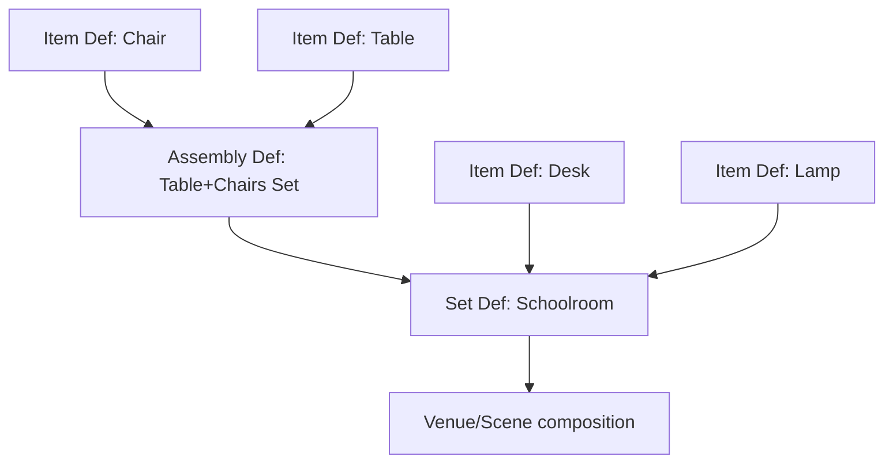
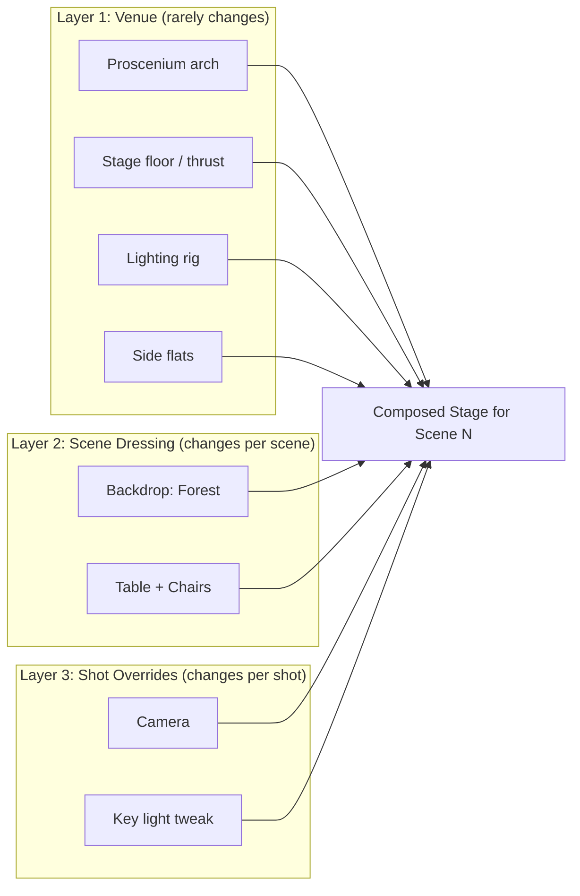

# Set / Staging Architecture — Design Notes

**Context:** Rapid visualisation app for animations. Fountain-derived script compiles to an
animation. Characters resolve via a catalogue + simple avatar-configurator editor when
unresolved. This document addresses the harder, still-unsolved problem: the **Set / Staging**
sub-app — the geometry/asset design system for scenes.

## The problem

A "resolve-or-create" pattern works cleanly for characters because a character is naturally
*flat*: one entity, one avatar, done. Sets resist this because they are actually **four
different problems wearing one trenchcoat**:

1. A **part-of** hierarchy (lamp is part of a desk-setup is part of a schoolroom)
2. A **catalogue-vs-placement** distinction (a "chair" definition vs *this specific chair,
   rotated 12°, missing its cushion*)
3. A **reuse-with-variation** problem (same set, minus one chair, for this scene only)
4. A **layering** problem (venue stays put across scenes; dressing changes scene-by-scene)

Trying to solve each of these with a bespoke structure produces a combinatorial, non-general
mess — exactly the "complexity happens early and the walking skeleton gets hamstrung" failure
mode to avoid.

**Reassurance:** all four collapse onto **one recursive primitive** if split correctly. This
mirrors well-proven prior art: Pixar's USD (composition arcs / layers), Unity's nested-prefab
system, Blender's library overrides, and real theatrical stagecraft (venue rig vs. per-show
scenery). This is a rediscovered pattern, not a novel gamble.

## The walking skeleton: one Node type, used fractally

Everything — an item, an assembly, a whole set, a whole theatre venue — is the **same kind of
object**:

```
Node {
  id: stable path segment            // "lamp_03"
  role: Prop | Light | Camera | RigAnchor | Structure
  ref: Definition (optional)         // "what catalogue thing is this an instance of?"
  transform: position/rotation/scale
  children: [Node]                   // recursion happens here
  overrides: [sparse patches]        // see below
  tags: freeform                     // "movable", "set-dressing", "venue"
}
```

- A **Definition** is a Node tree stored in the catalogue with no scene-specific placement.
- An **Instance** is a reference to a Definition plus a transform plus (crucially) a small list
  of *overrides* — not a copy.

Because a Definition's children can themselves be Instances of other Definitions,
"item / assembly / set / venue" are not four types to special-case — they are the **same tree
at different scales**:



**Consequence for the editor:** no need for three editors (item designer, assembly designer,
set designer). Build **one**: "arrange child nodes in space, optionally name the group and
publish it as a reusable Definition." Whether the children are primitives or entire schoolrooms
is irrelevant to the UI. Recursion collapses the tool count to one — this is the simplifying
paradigm.

## Reuse-with-variation: overrides, not copies

Solves "same set, minus one chair, for this scene." An Instance never duplicates its
Definition's contents; it carries a *sparse diff*:

```
SchoolroomInstance (ref: Schoolroom, in Scene 14) {
  overrides: [
    { path: "row2/chair3", op: "remove" },
    { path: "row1/desk1/lamp", op: "override_transform", value: {...} },
    { path: "blackboard", op: "swap_ref", value: "Blackboard_Cracked_v2" }
  ]
}
```

Editing the master Schoolroom Definition propagates to every scene using it, except wherever a
scene explicitly overrode something. This is the git-commit / CSS-cascade / Unity-prefab-override
mental model — it's what stops full re-authoring of set detail per scene.

## The venue-vs-dressing problem (theatre example)

This is a **layering** concern, orthogonal to the part-of hierarchy above. Don't model "theatre
base" as a parent of "this week's scenery" in the same tree — model a scene's final set as the
**composite of stacked layers**, each an independent Node tree:



The same trick applies to schoolroom / park / aircraft-cabin scenarios — most sets just have one
populated layer (venue == dressing), but the model doesn't care. An "aircraft cabin" reused
across three scenes is Layer 1 (cabin shell + seat rig) with Layer 2 overrides per scene
(different passengers' luggage, a spilled drink). The theatre case comes "for free" — it's the
same mechanism with more layers populated.

## Lights and cameras aren't architecturally special

Resist a separate "stage settings" object. They're just Nodes with `role: Light` or
`role: Camera`. The only genuinely special thing about them is *where in the layering they
conventionally get added* — typically the outermost (per-shot) layer rather than baked into a
reusable Item Definition. Nothing stops a "reading lamp" Item Definition from owning a child
Light node — that's a legitimate, general case, not an exception to code around.

## Why this keeps items identifiable for animation

Every node has a **stable path** (`Schoolroom/Row2/Desk3/Lamp`) that survives composition and
overrides, so the animation layer never needs a flattened mesh soup — it addresses nodes by
path, the same way you'd address a DOM element or a USD prim. Flattening only happens at final
render time, as a derived, throwaway artifact — never as the thing that's edited or animated.

## Suggested next step for the POC

Don't build the whole catalogue system first. Build the **skeleton** and prove it on
paper/mock-data against exactly three scenarios:

1. Schoolroom — plain single-layer set, deep nesting: item → assembly → set.
2. One scene removing a chair from a reused set — override mechanism.
3. Theatre base + per-scene scenery — layering mechanism.

If those three fall out of the same four-field Node schema (`role`, `ref`, `transform`,
`children` + `overrides`) without special-casing, that's a walking skeleton that won't need to
be ripped up. Everything after that — thumbnails, drag-and-drop UI, physics constraints,
snapping — is decoration on a stable foundation.

---

# Part 2 — Implementation Notes: How USD, Unity, and Blender Actually Do This

## The shared authoring UX pattern

All three reference systems avoid a "component mode" vs "scene mode" split. Instead:

- There is **one canvas** (viewport + hierarchy/outliner). You can sketch a primitive from
  scratch, drag in a catalogue item, or both, in the same session, side by side.
- "Is this a scene or a reusable component?" is not a mode chosen up front — it's a **status a
  node acquires** when deliberately extracted/published. Freshly-sketched geometry starts life
  as a plain, scene-local node. Select it → "Save as Asset / Make Prefab / Make Library" → it is
  written out to its own file/datablock, and the original node in the scene is swapped for a
  *reference* to that file. Nothing about the modelling UI changes; only where the data ends up.
- Editing an *instance* vs editing the *source* is governed by one concept: **where do my edits
  currently go?** Each system exposes this explicitly:

| System | "Where do edits go" mechanism |
|---|---|
| USD | **Edit Target** — explicitly pick which layer in the stack is "live"; every edit becomes an opinion written into that layer |
| Unity | **Prefab Mode** — double-click a prefab to enter an isolated editing context; anything done there writes into the prefab asset itself, not a scene |
| Blender | Entering a **linked** collection is read-only; entering via **Edit Library Override** allows touching specific properties, recorded as override operations, not baked into the source |

That single rule — "there's always a target for my current edit, and the tool tells me which one
it is" — is the crux of the UX. Everything else follows from it.

## USD — composition arcs

- A **Stage** is built by stacking **Layers** (ordered text/binary files of "opinions"). Layers
  combine via **composition arcs**: `sublayer`, `reference`, `payload`, `inherit`, `variant`,
  `specialize`.
- Each named node in the tree (a "prim", e.g. `/World/Set/Chair_03`) can be *defined* (`def`) in
  one layer and *overridden* (`over`) in another. An `over` only carries the deltas — it never
  needs to restate geometry.
- Building a "Schoolroom in Scene 14" in USD terms: `shot14.usda` references `schoolroom.usda`,
  then adds a handful of `over` prims for the removed chair and the swapped blackboard. The rest
  of the schoolroom is never re-serialized.
- **Payloads vs references**: payloads are the same idea as references but *lazily loaded* —
  USD's answer to scale (don't pull a million-polygon environment into memory until a shot
  actually needs it). Worth stealing conceptually even at small scale — it maps cleanly to "don't
  load an aircraft cabin's full detail until a scene actually stages it."
- Composition strength order is remembered as **LIVRPS** (Local > Inherits > Variants >
  References > Payloads > Specializes) — a fixed, predictable precedence for "who wins when two
  layers disagree about the same property." Nothing this elaborate is needed at small scale; the
  point worth keeping is *there is always a deterministic, documented resolution order*.
- Tooling reality: `usdview`, and USD panels in Houdini/Maya, expose a **layer stack inspector**
  — for any composed value you can ask "which layer actually authored this?" That debuggability
  is not optional polish; without it, an artist who edited a chair three layers deep has no way
  to find where their edit actually lives.

## Unity — nested prefabs & variants

- A **Prefab** = a serialized GameObject hierarchy saved as an asset (the Definition).
- A **Prefab Instance** in a scene (or nested inside another prefab) stores almost nothing
  itself: a link to the source prefab + a **flat list of property-path modifications** —
  literally `{ target object path, component type, property path, value }` tuples. Not a tree
  diff, a *property-path* diff. This is the single most reusable idea here and far simpler to
  implement than it sounds.
- **Nesting** is native: a prefab's children can themselves be prefab instances, arbitrarily
  deep — the "group of groups" requirement, exactly.
- **Prefab Variants** are the missing piece for a catalogue-of-catalogues: a Variant is itself a
  savable asset whose entire content is "base prefab + a stored override list," but promoted to
  first-class catalogue status, so it can then be instanced elsewhere (e.g. `RedStackingChair`
  variant of `StackingChair`, itself reused across ten sets).
- UX affordances that matter: an overridden property is shown **bold with a blue bar** in the
  Inspector so the artist always sees at a glance what's been touched. Right-click gives
  **Apply to Prefab** (push this instance's change back up into the shared source — mutates
  every other instance too) and **Revert** (discard the local override, snap back). This
  Apply/Revert pair is the practical, teachable version of "promote vs discard."
- Structural changes (added/removed child objects, not just property tweaks) are tracked in
  separate "added GameObjects" / "removed components" lists on the instance, distinct from the
  property-modification list.

## Blender — library overrides

- Historically, linking a collection from another `.blend` gave a **read-only** instance — fine
  for pure reuse, useless for "same set, minus one chair."
- **Library Overrides** (the newer mechanism) allow "make override" on a linked object/
  collection. Blender creates a local shadow ID mirroring the linked one, and any property then
  touched is recorded as an override *operation* (an RNA data-path + the new value) attached to
  that shadow ID — not baked into new geometry.
- On evaluation, Blender takes the linked source, then **replays the stored override
  operations** on top — a runtime patch-apply, conceptually identical to Unity's modification
  list or a USD `over`.
- The gnarly bit, worth knowing about before hitting it directly: **resync**. If the source
  library changes shape (an object is added/removed/renamed inside the linked collection),
  Blender has to recompute correspondence between the linked structure and the local override
  shadows, using stable internal identifiers — and it will warn about or drop overrides that no
  longer have a target. This is the real-world cost of "edit the master, propagate everywhere":
  someone has to reconcile old overrides against a changed Definition, and it isn't always
  silent.
- UX: the Outliner marks overridden data with a small icon overlay, and individual properties
  can be overridden one at a time (turn on override just for "visibility" on one modifier)
  rather than all-or-nothing — the same granularity idea as Unity's per-property modification
  list.

## Synthesis — what to actually build

USD's full generality or Blender's resync machinery aren't needed on day one. A pragmatic
minimum, borrowing the best bit from each:

**1. Definitions are files/records with stable child IDs, not array positions.**

```json
// Definition: Schoolroom.def.json
{
  "id": "def:schoolroom.v1",
  "children": [
    { "localId": "row2_chair3", "ref": "def:chair.v1", "transform": {} },
    { "localId": "blackboard",  "ref": "def:blackboard.v1", "transform": {} }
  ]
}
```

Give every child a **persistent localId** generated once at creation (a short UUID or slug),
never an index. This is the detail all three systems get right and every home-grown attempt
gets wrong — without it, overrides silently detach the moment someone reorders or inserts a
sibling.

**2. Instances carry a flat, path-addressed override list (Unity's model — simplest to
implement).**

```json
// Instance in Scene 14
{
  "ref": "def:schoolroom.v1",
  "transform": {},
  "overrides": [
    { "path": "row2_chair3", "op": "remove" },
    { "path": "blackboard",  "op": "swap_ref", "value": "def:blackboard_cracked.v2" },
    { "path": "row1_desk1/lamp", "op": "set", "field": "transform.rotationZ", "value": 12 }
  ]
}
```

Resolution rule at load time: `resolved = deep_copy(Definition)`, then apply overrides in list
order (`remove` deletes a subtree, `swap_ref` replaces the pointed-to Definition, `set` patches a
single field). That is the entire composition engine for v1 — no strength-ordering rules needed
until competing layers actually exist.

**3. One editing rule, driven by an explicit "edit target":**

- Double-click an instance in a scene → normal select/transform → any change is
  appended/updated in that instance's `overrides` list.
- Right-click "Edit Source" on an instance → opens the underlying Definition in the same
  viewport/editor UI, in an isolated context; edits there mutate the Definition file directly
  and ripple to every instance.
- Provide **Apply** (take a selected override, write its value into the Definition, remove it
  from the local override list) and **Revert** (discard the override) as one-click commands on
  any overridden property, exactly like Unity's bold-blue-bar affordance. This single UI
  convention is what makes the dual authoring mode (from-scratch vs from-catalogue) feel like
  one tool instead of two.

**4. "Promote to reusable" is the symmetric inverse operation:** select any subtree (however it
was authored — sketched or already-instanced), "Save as Definition" → write it out as a new
Definition record, replace the selection in place with an Instance pointing at it. This is how a
from-scratch sketch and a catalogue-drop coexist in one canvas without special-casing.

**5. Layers (venue vs dressing vs shot) are just 2–3 fixed, ordered override-sets, not a general
arbitrary stack.** Resolve as: `Definition → apply Venue overrides → apply Dressing overrides →
apply Shot overrides`, last-write-wins per field, removals/adds accumulate. This gives USD's
LIVRPS *benefit* (deterministic, inspectable precedence) without needing its full generality.

**6. Plan for resync from day one, even minimally.** When a Definition changes shape (a child
localId is deleted), scan every Instance's override list for orphaned `path`s and flag them in
the UI rather than silently dropping them — Blender's pain point is a preview of yours if this
step is skipped.

