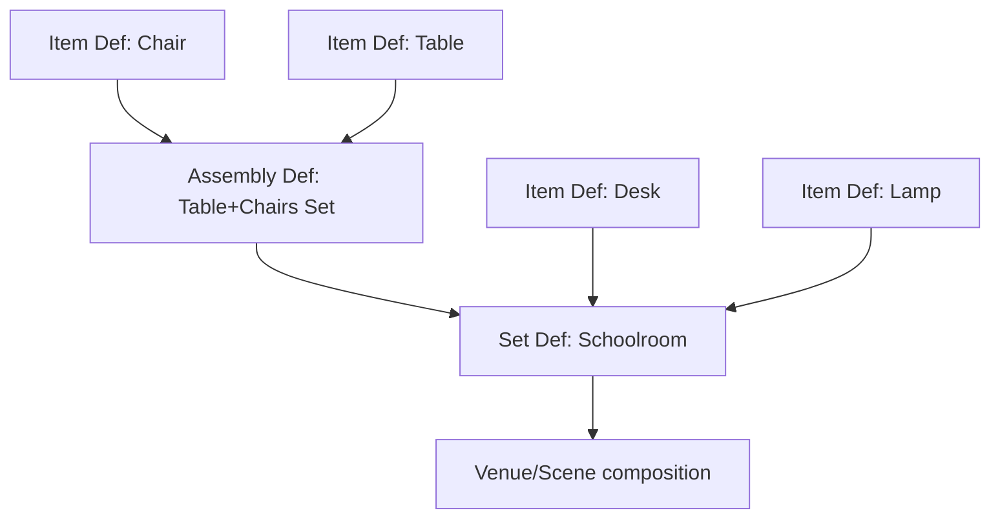
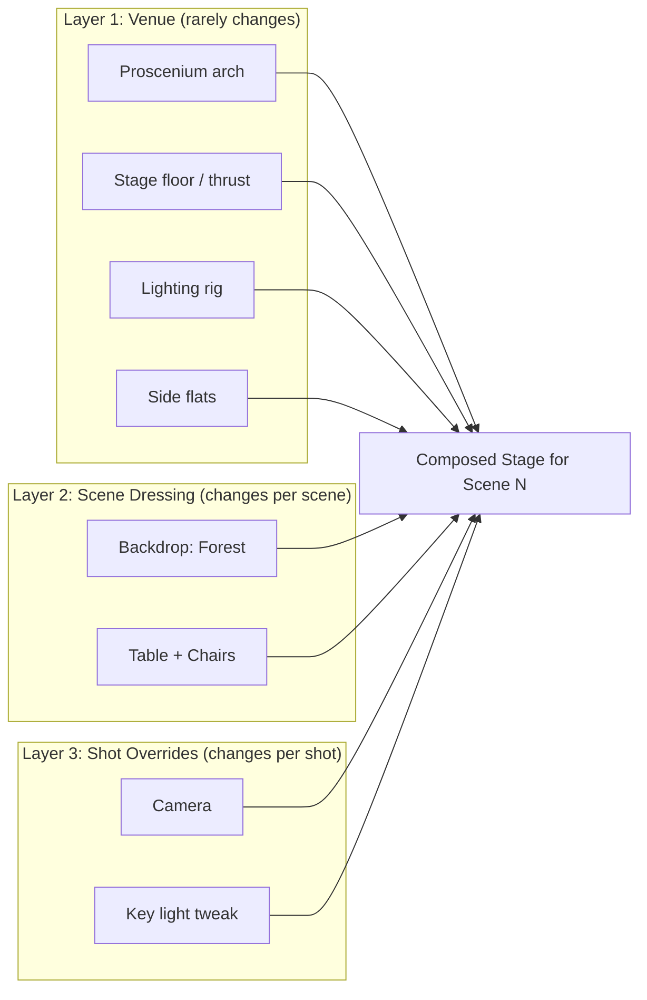

# Set / Staging Architecture — Design Notes

**Context:** Rapid visualisation app for animations. Fountain-derived script compiles to an
animation. Characters resolve via a catalogue + simple avatar-configurator editor when
unresolved. This document addresses the harder, still-unsolved problem: the **Set / Staging**
sub-app — the geometry/asset design system for scenes.

## The problem

A "resolve-or-create" pattern works cleanly for characters because a character is naturally
*flat*: one entity, one avatar, done. Sets resist this because they are actually **four
different problems wearing one trenchcoat**:

1. A **part-of** hierarchy (lamp is part of a desk-setup is part of a schoolroom)
2. A **catalogue-vs-placement** distinction (a "chair" definition vs *this specific chair,
   rotated 12°, missing its cushion*)
3. A **reuse-with-variation** problem (same set, minus one chair, for this scene only)
4. A **layering** problem (venue stays put across scenes; dressing changes scene-by-scene)

Trying to solve each of these with a bespoke structure produces a combinatorial, non-general
mess — exactly the "complexity happens early and the walking skeleton gets hamstrung" failure
mode to avoid.

**Reassurance:** all four collapse onto **one recursive primitive** if split correctly. This
mirrors well-proven prior art: Pixar's USD (composition arcs / layers), Unity's nested-prefab
system, Blender's library overrides, and real theatrical stagecraft (venue rig vs. per-show
scenery). This is a rediscovered pattern, not a novel gamble.

## The walking skeleton: one Node type, used fractally

Everything — an item, an assembly, a whole set, a whole theatre venue — is the **same kind of
object**:

```
Node {
  id: stable path segment            // "lamp_03"
  role: Prop | Light | Camera | RigAnchor | Structure
  ref: Definition (optional)         // "what catalogue thing is this an instance of?"
  transform: position/rotation/scale
  children: [Node]                   // recursion happens here
  overrides: [sparse patches]        // see below
  tags: freeform                     // "movable", "set-dressing", "venue"
}
```

- A **Definition** is a Node tree stored in the catalogue with no scene-specific placement.
- An **Instance** is a reference to a Definition plus a transform plus (crucially) a small list
  of *overrides* — not a copy.

Because a Definition's children can themselves be Instances of other Definitions,
"item / assembly / set / venue" are not four types to special-case — they are the **same tree
at different scales**:



**Consequence for the editor:** no need for three editors (item designer, assembly designer,
set designer). Build **one**: "arrange child nodes in space, optionally name the group and
publish it as a reusable Definition." Whether the children are primitives or entire schoolrooms
is irrelevant to the UI. Recursion collapses the tool count to one — this is the simplifying
paradigm.

## Reuse-with-variation: overrides, not copies

Solves "same set, minus one chair, for this scene." An Instance never duplicates its
Definition's contents; it carries a *sparse diff*:

```
SchoolroomInstance (ref: Schoolroom, in Scene 14) {
  overrides: [
    { path: "row2/chair3", op: "remove" },
    { path: "row1/desk1/lamp", op: "override_transform", value: {...} },
    { path: "blackboard", op: "swap_ref", value: "Blackboard_Cracked_v2" }
  ]
}
```

Editing the master Schoolroom Definition propagates to every scene using it, except wherever a
scene explicitly overrode something. This is the git-commit / CSS-cascade / Unity-prefab-override
mental model — it's what stops full re-authoring of set detail per scene.

## The venue-vs-dressing problem (theatre example)

This is a **layering** concern, orthogonal to the part-of hierarchy above. Don't model "theatre
base" as a parent of "this week's scenery" in the same tree — model a scene's final set as the
**composite of stacked layers**, each an independent Node tree:



The same trick applies to schoolroom / park / aircraft-cabin scenarios — most sets just have one
populated layer (venue == dressing), but the model doesn't care. An "aircraft cabin" reused
across three scenes is Layer 1 (cabin shell + seat rig) with Layer 2 overrides per scene
(different passengers' luggage, a spilled drink). The theatre case comes "for free" — it's the
same mechanism with more layers populated.

## Lights and cameras aren't architecturally special

Resist a separate "stage settings" object. They're just Nodes with `role: Light` or
`role: Camera`. The only genuinely special thing about them is *where in the layering they
conventionally get added* — typically the outermost (per-shot) layer rather than baked into a
reusable Item Definition. Nothing stops a "reading lamp" Item Definition from owning a child
Light node — that's a legitimate, general case, not an exception to code around.

## Why this keeps items identifiable for animation

Every node has a **stable path** (`Schoolroom/Row2/Desk3/Lamp`) that survives composition and
overrides, so the animation layer never needs a flattened mesh soup — it addresses nodes by
path, the same way you'd address a DOM element or a USD prim. Flattening only happens at final
render time, as a derived, throwaway artifact — never as the thing that's edited or animated.

## Suggested next step for the POC

Don't build the whole catalogue system first. Build the **skeleton** and prove it on
paper/mock-data against exactly three scenarios:

1. Schoolroom — plain single-layer set, deep nesting: item → assembly → set.
2. One scene removing a chair from a reused set — override mechanism.
3. Theatre base + per-scene scenery — layering mechanism.

If those three fall out of the same four-field Node schema (`role`, `ref`, `transform`,
`children` + `overrides`) without special-casing, that's a walking skeleton that won't need to
be ripped up. Everything after that — thumbnails, drag-and-drop UI, physics constraints,
snapping — is decoration on a stable foundation.
